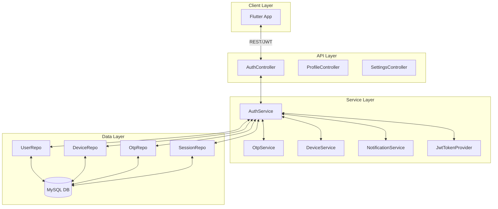
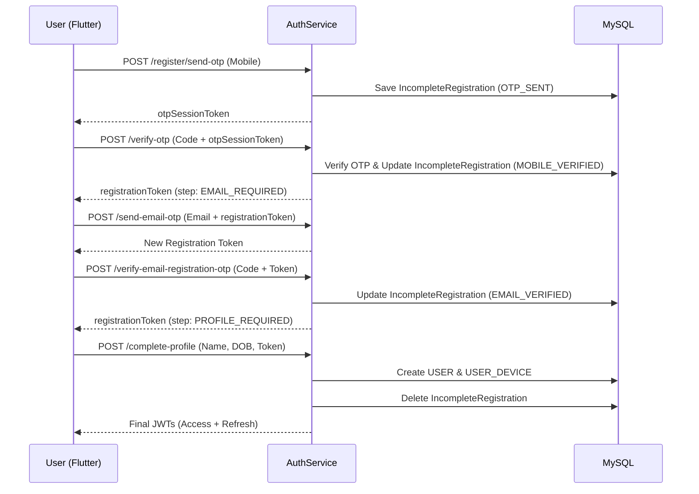
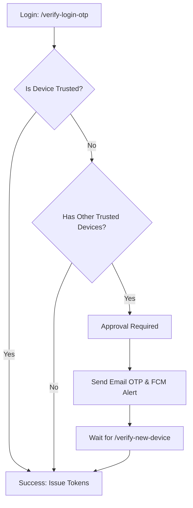

# 🏗️ Chronogram Auth Service — Detailed Technical Design

## 1. Executive Summary
The **Auth Service** is a mission-critical identity and access management (IAM) system for the Chronogram ecosystem. It provides a multi-layer security model, including device-bound authentication, SIM-swap protection, and a stateless multi-step registration flow.

---

## 2. Technology Stack
- **Framework:** Spring Boot 3.4.3 (Java 21)
- **Database:** **MySQL 8.x** (Primary Transactional Data)
- **Security:** Stateless JWT (io.jsonwebtoken) & Spring Security
- **Email/SMS:** Spring Boot Starter Mail & Notification Service (FCM)
- **Concurrency:** Transactional (@Transactional) with locking mechanisms for OTP integrity.

---

## 3. Core Architecture

The service follows a clean layered architecture, ensuring separation of concerns between API handling, business logic, and data persistence.

---

## 4. One-by-One Authentication Flows

### A. Multi-Step Registration Flow (Stateless)
The registration is strictly sequential. No user record is created until the final profile completion, preventing database spam.

| Step | Endpoint | Action | Token Produced | DB Impact |
|---|---|---|---|---|
| **1** | `/register/send-otp` | Sends Mobile OTP | `otpSessionToken` | `IncompleteRegistration` created (OTP_SENT) |
| **2** | `/verify-otp` | Verifies Mobile OTP | `registrationToken` (step: EMAIL_REQUIRED) | `IncompleteRegistration` updated (MOBILE_VERIFIED) |
| **3** | `/send-email-otp` | Sends Email OTP | New `registrationToken` | No Change |
| **4** | `/verify-email-registration-otp` | Verifies Email OTP | New `registrationToken` (step: PROFILE_REQUIRED) | `IncompleteRegistration` updated (EMAIL_VERIFIED) |
| **5** | `/complete-profile` | Saves User & Device | `accessToken` + `refreshToken` | `User` & `UserDevice` created; `IncompleteRegistration` deleted |

### B. Unified Login & Device Trust logic
The system employs a "Trusted Device" check on every login.

1.  **Trusted Attempt**: If hardware `deviceId` matches a trusted record in MySQL, login is immediate.
2.  **Untrusted Attempt**:
    *   If the user has **no other trusted devices**, this device is trusted implicitly (First Login).
    *   If the user has **existing trusted devices**, a secondary verification is triggered:
        *   FCM Alert sent to existing devices.
        *   OTP sent to registered Email.
        *   User must call `/verify-new-device`.

---

## 5. MySQL Data Model (Schema Overview)

The database design is optimized for security and traceability.

### 5.1 Identity Tables
- **`user`**: Core profile data.
    - `user_id` (PK), `mobile_number` (Unique), `email` (Unique), `status_id` (FK), `approval_status`, `locked_until`.
- **`user_status`**: Master table for status codes (`ACTIVE`, `BLOCK`, `SUSPEND`, `DELETE`).
- **`incomplete_registration`**: Temporary storage for the stateless registration flow.

### 5.2 Security & Session Tables
- **`user_device`**: Binding hardware identifiers to accounts.
    - `device_id`, `push_token`, `is_trusted`, `sim_serial`.
- **`user_session`**: Active login sessions.
    - `refresh_token_hash` (SHA-256), `expires_timestamp`, `is_revoked`.
- **`otp_verification`**: History and state of all generated OTPs.
    - `target` (mobile/email), `otp_type`, `session_id`, `attempts`.

### 5.3 Audit Tables
- **`login_history`**: Comprehensive log for every login attempt (Successful or Failed).
- **`admin_audit_log`**: Tracking administrator actions.

---

## 6. Security Hardening Details

### 6.1 Token Security
- **JWT Binding**: Intermediate tokens are cryptographically bound to the specific `deviceId` and `sessionId` in MySQL. Cross-device or stale session token reuse is technically impossible.
- **Refresh Token Rotation**: Refresh tokens are stored as **one-way SHA-256 hashes** in MySQL. Even a direct database breach does not expose the current usable refresh tokens.

### 6.2 Rate Limiting & Lockout
- **Brute Force Defense**: 5 failed OTP attempts trigger an automatic account lockout in the `user` table (`locked_until` field) for 15 minutes.
- **Resend Cooling**: Sequential "resend" requests are tracked to prevent SMS/Email spamming.

### 6.3 SIM-Swap Protection
- The system requires `simSerial` during the critical registration and trusted device binding phases, providing an additional layer of hardware-based identity.

---

## 7. Operational Guidelines
- **Cleanup**: Incomplete registrations are automatically cleaned up upon successful profile completion.
- **Microservices**: Other services (Image Service, etc.) validate user identity via the stateless `GET /api/auth/validate-session` endpoint.
