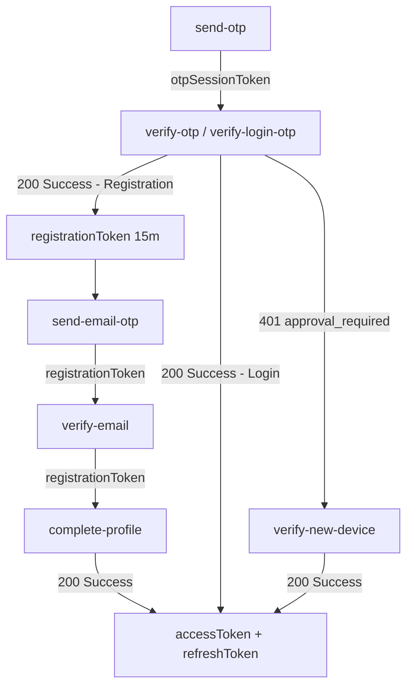

# 🧪 Chronogram Auth Service — API Testing Guide

**Base URL:** `http://localhost:8081/api` (Testing) / `http://localhost:8086/api` (Gateway)  
**Version:** 3.0 (April 2026)  
**Security:** Stateless JWT + Session Binding  

---

## 📋 Table of Contents

| # | Endpoint | Method | Key Change |
|---|---|---|---|
| 1 | [Register: Send Mobile OTP](#1-register--send-mobile-otp) | POST | skipSms for Firebase |
| 2 | [Register: Verify Mobile OTP](#2-register--verify-mobile-otp) | POST | SIM Serial Required |
| 3 | [Register: Send Email OTP](#3-register--send-email-otp) | POST | Progressive Limits |
| 4 | [Register: Verify Email OTP](#4-register--verify-email-otp) | POST | Stateless Token |
| 5 | [Register: Complete Profile](#5-register--complete-profile) | POST | Instant Login (No Approval) |
| 6 | [Login: Send OTP](#6-login--send-otp) | POST | Upfront Blocked Check |
| 7 | [Login: Verify OTP](#7-login--verify-otp) | POST | Trusted Device Check |
| 8 | [New Device: Verify](#8-new-device--verify) | POST | 401 Approval Required |
| 9 | [New Device: Resend OTP](#9-new-device--resend-otp) | POST | Temporary Session |
| 10 | [Resend: Register OTP](#10-resend-register-otp) | POST | Multi-Target Support |
| 11 | [Resend: Login OTP](#11-resend-login-otp) | POST | - |
| 12 | [Link Email: Send OTP](#12-link-email--send-otp) | POST | Protected Auth |
| 13 | [Link Email: Verify](#13-link-email--verify) | POST | Immutable Record | 
| 14 | [Refresh Token](#14-refresh-token) | POST | SHA-256 Hashing |
| 15 | [Validate Session](#15-validate-session) | GET | Microservice Health |
| 16 | [Get Profile (me)](#16-get-my-profile) | GET | Masked Privacy |
| 17 | [Logout](#17-logout) | POST | Token Revocation |
| 18 | [Profile Management](#18-profile-management) | GET/PUT | - |
| 19 | [Storage API](#19-storage-api) | GET | - |
| 20 | [Settings API](#20-settings-api) | GET/PUT | - |
| 21 | [Delete Account](#21-delete-account) | DELETE | App Store Compliant |
| 22 | [Firebase Auth](#22-firebase-auth) | POST | Global Identifier |

---

## 🛡️ Global Security Notes

- **Auth Header:** `Authorization: Bearer <ACCESS_TOKEN>` (required for all protected endpoints)
- **Progressive OTP Expiration & Lockout Policy:** 
  - **1st Request:** Valid for 2 minutes.
  - **2nd Request:** Valid for 3 minutes.
  - **3rd Request:** Valid for 5 minutes.
  - **4th Request onwards:** **BLOCKED** for 120 minutes (2-hour lock).
- **Attempt Tracking:** Hitting "Send OTP" again (even if you navigate back/forth) will increment your resend count and increase the timer length. It will NO LONGER throw a "Please wait" error.
- **Firebase Mode:** If `skipSms: true` is sent, the backend tracks the cooldown but does NOT generate a real SMS code.
- **Traceability:** Every response includes `X-Correlation-ID`. Log this for debugging.
- **Payload Limits:** JSON: 100KB · Photo: 5MB · Multipart: 15MB

---

## 🔗 Token Chain Flow



---

## 1. Register – Send Mobile OTP

**`POST /api/auth/register/send-otp`**

**Request:**
```json
{
  "mobileNumber": "9876543210",
  "deviceId": "DEVICE_UUID_123",
  "deviceName": "Pixel 8",
  "deviceModel": "Pixel 8",
  "osName": "Android",
  "osVersion": "14",
  "appVersion": "1.0.0",
  "latitude": 28.6139,
  "longitude": 77.2090,
  "city": "New Delhi",
  "country": "India",
  "skipSms": true
}
```

> `mobileNumber`, `deviceId` are **required**. `skipSms` is optional (set to `true` when using Firebase Phone Auth on the client side to prevent double SMS). All other fields are optional but recommended for analytics.

**Response `200 OK`:**
```json
{
  "message": "OTP sent successfully.",
  "otpSessionToken": "eyJhbGci...",
  "expiresInMinutes": 2,
  "attemptsRemaining": 2
}
```

> ℹ️ Backend does NOT echo OTPs for security. Developers should check the `otp_verification` MySQL table for the code during testing.

**Errors:**
| Status | Message |
|---|---|
| `400` | `"Invalid mobile number format. Must be 10 digits."` |
| `400` | `"Device ID is required"` |
| `409` | `"You are already registered. Please login."` |
| `429` | `"You have reached the maximum number of OTP requests. Please try again after 2 hours for security."` |
| `429` | `"Too many requests. For your security, this phone number or email is temporarily locked for X minutes."` |


---

## 2. Register – Verify Mobile OTP

**`POST /api/auth/verify-otp`**

**Request:**
```json
{
  "mobileNumber": "9876543210",
  "otpCode": "123456",
  "otpSessionToken": "eyJhbGci...",
  "deviceId": "DEVICE_UUID_123",
  "simSerial": "SIM_12345",
  "pushToken": "FCM_TOKEN",
  "deviceName": "Pixel 8",
  "deviceModel": "Pixel 8",
  "osName": "Android"
}
```

**Response `200 OK`:**
```json
{
  "accessToken": "eyJhbGci...",
  "message": "Mobile verified. Verify Email to proceed."
}
```

> ℹ️ The `accessToken` returned here IS the **registrationToken** (valid for 15 mins).

**Errors:**
| Status | Message |
|---|---|
| `400` | `"Invalid Mobile OTP"` |
| `400` | `"OTP not found or expired. Please request a new one."` |
| `400` | `"SIM_REQUIRED: Registration requires a valid SIM card."` |
| `401` | `"Invalid session: The session token has expired or been replaced."` |


---

## 3. Register – Send Email OTP

**`POST /api/auth/send-email-otp`**

**Request:**
```json
{
  "email": "user@gmail.com",
  "registrationToken": "eyJhbGci..."
}
```

**Response `200 OK`:**
```json
{
  "message": "Email OTP sent successfully.",
  "accessToken": "eyJhbGci...",
  "expiresInMinutes": 2,
  "attemptsRemaining": 2
}
```

> ⚠️ The `accessToken` returned here is the updated **registrationToken** (valid for 15 mins).


---

## 4. Register – Verify Email OTP

**`POST /api/auth/verify-email-registration-otp`**

**Request:**
```json
{
  "email": "user@gmail.com",
  "otpCode": "000000",
  "registrationToken": "eyJhbGci..."
}
```

**Response `200 OK`:**
```json
{
  "accessToken": "eyJhbGci...",
  "message": "Email verified. Complete profile to finalize registration."
}
```

---

## 5. Register – Complete Profile

**`POST /api/auth/complete-profile`**

**Request:**
```json
{
  "name": "John Doe",
  "dob": "1990-01-15",
  "registrationToken": "eyJhbGci...",
  "deviceId": "DEVICE_UUID_123",
  "deviceName": "Pixel 8",
  "deviceModel": "Pixel 8",
  "osName": "Android",
  "osVersion": "14",
  "appVersion": "1.0.0"
}
```

**Response `200 OK`:**
```json
{
  "accessToken": "eyJhbG...",
  "refreshToken": "eyJhbG...",
  "role": "USER",
  "message": "Login successful."
}
```

> 🚀 **Security Note:** Manual Admin approval is bypassed! Completion seamlessly logs the user in and delegates an immediate `accessToken` & `refreshToken`!


---

## 6. Login – Send OTP

**`POST /api/auth/login/send-otp`**

**Request:**
```json
{
  "mobileNumber": "9876543210",
  "deviceId": "DEVICE_UUID_123",
  "deviceName": "Pixel 8",
  "osName": "Android",
  "skipSms": true
}
```

**Response `200 OK`:**
```json
{
  "message": "OTP sent successfully.",
  "otpSessionToken": "eyJhbGci...",
  "expiresInMinutes": 2,
  "attemptsRemaining": 2
}
```


---

## 7. Login – Verify OTP

**`POST /api/auth/verify-login-otp`**

**Request:**
```json
{
  "mobileNumber": "9876543210",
  "otpCode": "654321",
  "otpSessionToken": "eyJhbGci...",
  "deviceId": "DEVICE_UUID_123"
}
```

**Response `200 OK` (Trusted Device):**
```json
{
  "accessToken": "eyJhbGci...",
  "refreshToken": "eyJhbGci...",
  "role": "USER",
  "message": "Login successful."
}
```

**Response `401 Unauthorized` (New/Untrusted Device):**
```json
{
  "status": 401,
  "message": "APPROVAL_REQUIRED: Security OTP sent to email.",
  "maskedEmail": "jo***@gmail.com",
  "temporaryToken": "eyJhbGci..."
}
```

> ➡️ On `APPROVAL_REQUIRED`: Navigate user to **New Device Verify** screen.


---

## 8. New Device – Verify

**`POST /api/auth/verify-new-device`**

**Request:**
```json
{
  "mobileNumber": "9876543210",
  "otp": "112233",
  "deviceId": "DEVICE_UUID_123",
  "temporaryToken": "eyJhbGci..."
}
```

**Response `200 OK`:**
```json
{
  "accessToken": "eyJhbGci...",
  "refreshToken": "eyJhbGci...",
  "role": "USER",
  "message": "Login successful."
}
```


---

## 9. New Device – Resend OTP

**`POST /api/auth/resend-new-device-otp`**

**Request:**
```json
{
  "temporaryToken": "eyJhbGci..."
}
```

**Response `200 OK`:**
```json
{
  "message": "New Device OTP resent successfully to registered email.",
  "temporaryToken": "eyJhbGci...",
  "expiresInMinutes": 5,
  "attemptsRemaining": 0
}
```


---

## 10. Resend Register OTP

**`POST /api/auth/register/resend-otp`**

### For Email OTP:
```json
{
  "email": "user@gmail.com",
  "registrationToken": "eyJhbGci..."
}
```

**Response `200 OK`:**
```json
{
  "message": "Email OTP resent successfully.",
  "accessToken": "eyJhbGci...",
  "expiresInMinutes": 5,
  "attemptsRemaining": 0
}
```

### For Mobile OTP:
```json
{
  "mobileNumber": "9876543210",
  "deviceId": "DEVICE_UUID_123"
}
```

**Response `200 OK`:**
```json
{
  "message": "Mobile OTP resent successfully.",
  "otpSessionToken": "eyJhbGci...",
  "expiresInMinutes": 5,
  "attemptsRemaining": 0
}
```

---

## 11. Resend Login OTP

**`POST /api/auth/login/resend-otp`**

**Request:**
```json
{
  "mobileNumber": "9876543210",
  "deviceId": "DEVICE_UUID_123"
}
```

**Response `200 OK`:**
```json
{
  "message": "Mobile OTP resent successfully.",
  "otpSessionToken": "eyJhbGci...",
  "expiresInMinutes": 5,
  "attemptsRemaining": 0
}
```


---

## 12. Link Email – Send OTP

**`POST /api/auth/link-email`**  
**Header:** `Authorization: Bearer <ACCESS_TOKEN>`

**Request:**
```json
{
  "email": "user@gmail.com",
  "accessToken": "eyJhbGci..."
}
```

**Response `200 OK`:**
```json
{
  "message": "OTP sent to email.",
  "registrationToken": "eyJhbGci...",
  "expiresInMinutes": 2,
  "attemptsRemaining": 2
}
```

---

## 13. Link Email – Verify

**`POST /api/auth/verify-email-link`**

**Request:**
```json
{
  "email": "user@gmail.com",
  "otp": "334455",
  "registrationToken": "eyJhbGci..."
}
```

**Response `200 OK`:**
```json
{
  "accessToken": "eyJhbGci...",
  "refreshToken": null,
  "message": "Email linked. Complete profile to proceed."
}
```

---

## 14. Refresh Token

**`POST /api/auth/refresh-token?refreshToken=<REFRESH_TOKEN>`**

**Response `200 OK`:**
```json
{
  "accessToken": "eyJhbGci...",
  "refreshToken": "eyJhbGci...",
  "message": "Token refreshed successfully."
}
```

**Errors:**
| Status | Message |
|---|---|
| `401` | `"Session expired or revoked. Please login again."` |
| `410` | `"Account deleted."` |

> 🔄 Implement automatic token refresh when any API returns `401`. Retry the original request once with the new accessToken.

---

## 15. Validate Session

**`GET /api/auth/validate-session`**  
**Header:** `Authorization: Bearer <ACCESS_TOKEN>`

Used by internal microservices to validate tokens. Clients can also use this as a health-check.

**Response `200 OK`** (empty body — token is valid)  
**Response `401`** (token expired or invalid)

---

## 16. Get My Profile

**`GET /api/auth/me`**  
**Header:** `Authorization: Bearer <ACCESS_TOKEN>`

**Response `200 OK`:**
```json
{
  "userId": 42,
  "name": "John Doe",
  "email": "jo***@gmail.com",
  "mobileNumber": "+9198******10",
  "dob": "1990-01-15",
  "approvalStatus": "APPROVED",
  "status": "Active"
}
```

> ℹ️ Email and mobile are **masked** in this response for privacy.

---

## 17. Logout

**`POST /api/auth/logout?refreshToken=<REFRESH_TOKEN>`**  
**Header:** `Authorization: Bearer <ACCESS_TOKEN>`

**Response `200 OK`:**
```
"Logged out successfully"
```

> Call this on app logout, session switch, or account switch. The refreshToken is invalidated server-side.

---

## 18. Profile Management

### GET Profile
**`GET /api/profile`** · **Header:** `Authorization: Bearer <ACCESS_TOKEN>`

> ℹ️ **Note:** Profile pictures are now managed exclusively by the **Image Service**. To upload or manage profile pictures, please refer to the `image-service` documentation.

```json
{
  "name": "John Doe",
  "email": "john@gmail.com"
}
```

### Update Name
**`PUT /api/profile`** · **Header:** `Authorization: Bearer <ACCESS_TOKEN>`

```json
{ "name": "Jane Doe" }
```

**Response `200 OK`:** Returns updated profile.


---

## 19. Storage API

**`GET /api/auth/storage/usage`**  
**Header:** `Authorization: Bearer <ACCESS_TOKEN>`

**Response `200 OK`:**
```json
{
  "userId": 42,
  "images": { "count": 15, "bytes": 3435973836 },
  "videos": { "count": 5, "bytes": 3006477107 },
  "totalBytes": 6442450943
}
```

> ℹ️ This provides *your own* storage metrics. For global system-wide storage (Admin only), see the Admin section.

---

## 20. Settings API

### Get Sync Preference
**`GET /api/settings/sync`** · **Header:** `Authorization: Bearer <ACCESS_TOKEN>`

```json
{ "mode": "WIFI_ONLY" }
```

### Update Sync Preference
**`PUT /api/settings/sync`** · **Header:** `Authorization: Bearer <ACCESS_TOKEN>`

```json
{ "mode": "ANY_NETWORK" }
```

Modes: `WIFI_ONLY` | `ANY_NETWORK`

---

## 21. Delete Account

**`DELETE /api/account`**  
**Header:** `Authorization: Bearer <ACCESS_TOKEN>`

> Required for Apple App Store submissions. Soft deletes the account.

**Response `200 OK`:**
```json
{ "message": "Account deleted successfully" }
```

---

## 22. Firebase Auth

This endpoint is used for **direct login/registration** using a Firebase ID Token (after mobile verification on the client side).

### Login / Register
**`POST /api/auth/firebase-login`**  
**`POST /api/auth/firebase-register`** (same logic)

```json
{
  "firebaseIdToken": "eyJhbGci...",
  "deviceId": "DEVICE_UUID_123",
  "deviceName": "iPhone 15",
  "osName": "iOS",
  "osVersion": "17",
  "appVersion": "1.0.0"
}
```

**Response `200 OK` (Existing User - Trusted Device):**
```json
{
  "accessToken": "eyJhbGci...",
  "refreshToken": "eyJhbGci...",
  "message": "Login successful."
}
```

**Response `401` (Existing User - New Device):**
```json
{
  "status": 401,
  "message": "APPROVAL_REQUIRED: Security OTP sent to email.",
  "maskedEmail": "jo***@gmail.com",
  "temporaryToken": "eyJhbGci..."
}
```

**Response `200 OK` (New/Incomplete User):**
```json
{
  "accessToken": "eyJhbGci...",
  "message": "Firebase verification successful. Please verify your email to proceed."
}
```

> ⚠️ For new users, the `accessToken` returned is a **registrationToken** (Step: `EMAIL_REQUIRED`). You must call **Step 3 (Send Email OTP)** using this token.

**Errors:**
| Status | Message |
|---|---|
| `401` | `"Firebase Authentication Failed"` |
| `410` | `"This account has been deleted."` |
| `429` | `"Account is temporarily locked."` |


---

## 🚀 Flutter: Step-by-Step Firebase Implementation

Follow this sequence to implement Mobile Auth correctly using Firebase on the client side:

### 1. Request Session from Backend
Before calling Firebase, always call the Backend to check user status and start the security session.
- **Endpoint**: `POST /api/auth/register/send-otp` (or `/login/send-otp`)
- **Key Field**: `"skipSms": true`
- **Why?**: This prevents the Backend from sending a second SMS and returns the `otpSessionToken` needed for the next steps. It also enforces the 2-3-5 cooldown.

### 2. Trigger Firebase SMS (Flutter SDK)
Use the standard Firebase SDK logic:
```dart
await FirebaseAuth.instance.verifyPhoneNumber(
  phoneNumber: '+919876543210',
  verificationCompleted: (PhoneAuthCredential credential) async {
    // Auto-verification handling
  },
  codeSent: (String verificationId, int? resendToken) {
    // Store verificationId for manual entry
  },
  // ... rest of Firebase logic
);
```

### 3. Verify OTP & Get ID Token
Once the user enters the digits in your app:
1. Create a credential: `PhoneAuthProvider.credential(verificationId: vid, smsCode: code)`
2. Sign in: `UserCredential user = await FirebaseAuth.instance.signInWithCredential(credential);`
3. **CRITICAL**: Get the ID Token: `String? idToken = await user.user?.getIdToken();`

### 4. Finalize with Backend
Now send the Firebase token to the Chronogram Backend to get your final Session Tokens.
- **Endpoint**: `POST /api/auth/firebase-login`
- **Body**:
  ```json
  {
    "firebaseIdToken": "<THE_ID_TOKEN_FROM_STEP_3>",
    "otpSessionToken": "<THE_TOKEN_FROM_STEP_1>",
    "deviceId": "...",
    "deviceName": "..."
  }
  ```

### 5. Handle the Result
- **Existing User (Login)**: You receive `accessToken` + `refreshToken`. App is ready!
- **New User (Registration)**: You receive an `accessToken` (This is actually a **RegistrationToken**). 
    - The backend requires Email next. 
    - **Next Step**: Call `POST /api/auth/send-email-otp` using the token you just received.

---

---

## 👑 Web Admin Panel APIs (Dashboard)

The Admin API endpoints are completely separated from the generic Flutter/APK users app flow. They use stateless JWTs and are designed specifically for Web/Postman integration.

### 1. Admin Login
**`POST /api/auth/admin/login`**

**Request:**
```json
{
  "username": "admin",
  "password": "password123"
}
```

**Response `200 OK`:**
```json
{
  "accessToken": "eyJhbGci...",
  "refreshToken": "eyJhbGci...",
  "role": "ADMIN",
  "message": "Login successful"
}
```
> **Note:** Admins use stateless JWTs, meaning there are no concurrent device limitations. 

### 2. Admin Register (Local Setup)
**`POST /api/auth/admin/register?username=admin&email=admin@test.com&password=password123&role=SUPER_ADMIN`**

> **Note:** Use this endpoint locally via Postman when setting up your new local database since the `chronogram_auth` DB will start empty!

### 3. Fetch All Users
**`GET /api/admin/users`**  
**Header:** `Authorization: Bearer <ADMIN_ACCESS_TOKEN>`

### 4. Fetch All Devices
**`GET /api/admin/users/devices`**  
**Header:** `Authorization: Bearer <ADMIN_ACCESS_TOKEN>`

### 5. Fetch Storage Stats
**`GET /api/admin/users/storage/stats`**  
**Header:** `Authorization: Bearer <ADMIN_ACCESS_TOKEN>`

### 6. Synchronize Storage Data
**`POST /api/admin/users/storage/sync`**  
**Header:** `Authorization: Bearer <ADMIN_ACCESS_TOKEN>`
> **Note:** Call this endpoint to manually trigger a fetch array from Image-Service and Video-Service to re-calculate all Storage usages actively.

### 7. Actions (Block/Unblock/Delete)
- **Block User:** `POST /api/admin/users/{userId}/block`
- **Unblock User:** `POST /api/admin/users/{userId}/unblock`
- **Soft Delete User:** `DELETE /api/admin/users/{userId}`
