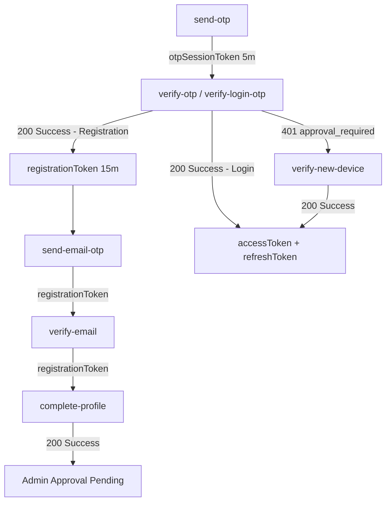

# 🧪 Chronogram Auth Service — API Testing Guide

**Base URL:** `http://localhost:8086/api`  
**Version:** 2.1 (Updated March 2026)  
**Security:** Stateless JWT + Session Binding  

---

## 📋 Table of Contents

| # | Endpoint | Method | Key Change |
|---|---|---|---|
| 1 | [Register: Send Mobile OTP](#1-register--send-mobile-otp) | POST | skipSms for Firebase |
| 2 | [Register: Verify Mobile OTP](#2-register--verify-mobile-otp) | POST | SIM Serial Required |
| 3 | [Register: Send Email OTP](#3-register--send-email-otp) | POST | 5-min Expiration |
| 4 | [Register: Verify Email OTP](#4-register--verify-email-otp) | POST | Stateless Token |
| 5 | [Register: Complete Profile](#5-register--complete-profile) | POST | Admin Approval State |
| 6 | [Login: Send OTP](#6-login--send-otp) | POST | Upfront Blocked Check |
| 7 | [Login: Verify OTP](#7-login--verify-otp) | POST | Trusted Device Check |
| 8 | [New Device: Verify](#8-new-device--verify) | POST | 401 Approval Required |
| 9 | [New Device: Resend OTP](#9-new-device--resend-otp) | POST | Temporary Session |
| 10 | [Resend: Register OTP](#10-resend-register-otp) | POST | Multi-Target Support |
| 11 | [Resend: Login OTP](#11-resend-login-otp) | POST | - |
| 12 | [Link Email: Send OTP](#12-link-email--send-otp) | POST | Protected Auth |
| 13 | [Refresh Token](#14-refresh-token) | POST | SHA-256 Hashing |
| 14 | [Validate Session](#15-validate-session) | GET | Microservice Health |
| 15 | [Get Profile (me)](#16-get-my-profile) | GET | Masked Privacy |
| 16 | [Logout](#17-logout) | POST | Token Revocation |
| 17 | [Storage: Get Usage](#19-storage-api) | GET | - |
| 18 | [Settings: Sync Pref](#20-settings-api) | GET / PUT | - |
| 19 | [Account: Delete](#21-delete-account) | DELETE | App Store Compliant |
| 20 | [Firebase Login/Register](#22-firebase-auth) | POST | Global Identifier |

---

## 🛡️ Global Security Notes

- **Auth Header:** `Authorization: Bearer <ACCESS_TOKEN>` (required for all protected endpoints)
- **OTP Expiration:** ALL OTPs are valid for **5 minutes** precisely.
- **OTP Lockout Policy:** 
  - 5 wrong codes OR 5 resends → **15-minute account lockout**.
  - Lockout reason is returned in the `message` field with status `429`.
- **Traceability:** Every response includes `X-Correlation-ID`. Log this for debugging.
- **Deleted Accounts → `410 Gone`:** `"This account has been deleted."`
- **Blocked Accounts → `403 Forbidden`:** `"Account is blocked. Reason: ..."`
- **Deleted Accounts → `410 Gone`:** `"Account deleted."`
- **Payload Limits:** JSON: 100KB · Photo: 5MB · Multipart: 15MB

---

## 🔗 Token Chain




---

## 1. Register – Send Mobile OTP

**`POST /api/auth/register/send-otp`**

**Request:**
```json
{
  "mobileNumber": "9876543210",
  "deviceId": "DEVICE_UUID_123",
  "deviceName": "Pixel 8",
  "deviceModel": "Pixel 8",
  "osName": "Android",
  "osVersion": "14",
  "appVersion": "1.0.0",
  "latitude": 28.6139,
  "longitude": 77.2090,
  "city": "New Delhi",
  "country": "India",
  "skipSms": true
}
```

> `mobileNumber`, `deviceId` are **required**. `skipSms` is optional (set to `true` when using Firebase Phone Auth on the client side to prevent double SMS). All other fields are optional but recommended for analytics.

**Response `200 OK`:**
```json
{
  "message": "OTP sent successfully.",
  "otpSessionToken": "eyJhbGci..."
}
```

> ℹ️ Backend does NOT echo OTPs for security. Developers should check the `otp_verification` table for the code during testing.

**Errors:**
| Status | Message |
|---|---|
| `400` | `"Invalid mobile number format. Must be 10 digits."` |
| `400` | `"Device ID is required"` |
| `409` | `"You are already registered. Please login."` |
| `429` | `"Account is temporarily locked. Try again after 15 minute(s)."` |
| `410` | `"This account has been deleted. Please contact support."` |


---

## 2. Register – Verify Mobile OTP

**`POST /api/auth/verify-otp`**

**Request:**
```json
{
  "mobileNumber": "9876543210",
  "otpCode": "123456",
  "otpSessionToken": "eyJhbGci...",
  "deviceId": "DEVICE_UUID_123",
  "simSerial": "SIM_12345",
  "pushToken": "FCM_TOKEN",
  "deviceName": "Pixel 8",
  "deviceModel": "Pixel 8",
  "osName": "Android",
  "osVersion": "14",
  "appVersion": "1.0.0",
  "latitude": 28.6139,
  "longitude": 77.2090,
  "city": "New Delhi",
  "country": "India"
}
```

**Response `200 OK`:**
```json
{
  "accessToken": "eyJhbGci...",
  "message": "Mobile verified. Verify Email to proceed."
}
```

> ℹ️ The `accessToken` returned here IS the **registrationToken** (valid for 15 mins).

**Errors:**
| Status | Message |
|---|---|
| `400` | `"Invalid Mobile OTP"` |
| `400` | `"OTP not found or expired. Please request a new one."` |
| `400` | `"SIM_REQUIRED: Registration requires a valid SIM card."` |
| `401` | `"Invalid session: The session token has expired or been replaced."` |
| `403` | `"OTP session mismatch: This token belongs to a different mobile number."` |
| `429` | `"Your account is temporarily locked. Please try again after 15 minute(s)."` |


---

## 3. Register – Send Email OTP

**`POST /api/auth/send-email-otp`**

**Request:**
```json
{
  "email": "user@gmail.com",
  "registrationToken": "eyJhbGci..."
}
```

**Response `200 OK`:**
```json
{
  "message": "Email OTP sent successfully.",
  "accessToken": "eyJhbGci..."
}
```

> ⚠️ The `accessToken` returned here is the updated **registrationToken** (valid for 15 mins). The Email OTP is valid for **5 mins**.

**Errors:**
| Status | Message |
|---|---|
| `400` | `"Email is required for registration."` |
| `400` | `"Invalid email format."` |
| `400` | `"Email already in use. Please use a different email."` |
| `401` | `"Invalid registration token."` |
| `403` | `"Invalid registration step. Cannot send email OTP."` |


---

## 4. Register – Verify Email OTP

**`POST /api/auth/verify-email-registration-otp`**

**Request:**
```json
{
  "email": "user@gmail.com",
  "otpCode": "000000",
  "registrationToken": "eyJhbGci..."
}
```

**Response `200 OK`:**
```json
{
  "accessToken": "eyJhbGci...",
  "message": "Email verified. Complete profile to finalize registration."
}
```

**Errors:**
| Status | Message |
|---|---|
| `400` | `"Invalid OTP"` |
| `400` | `"OTP expired."` |
| `400` | `"OTP must be exactly 6 digits."` |
| `401` | `"Invalid registration token."` |

---

## 5. Register – Complete Profile

**`POST /api/auth/complete-profile`**

**Request:**
```json
{
  "name": "John Doe",
  "dob": "1990-01-15",
  "registrationToken": "eyJhbGci...",
  "deviceId": "DEVICE_UUID_123",
  "deviceName": "Pixel 8",
  "deviceModel": "Pixel 8",
  "osName": "Android",
  "osVersion": "14",
  "appVersion": "1.0.0"
}
```

**Response `200 OK` (NEW):**
```json
{
  "accessToken": null,
  "refreshToken": null,
  "message": "your profile created wait for admin approval"
}
```

> 🛡️ **Security Note:** In the latest version, `complete-profile` does NOT issue security tokens. Users must remain on a "Waiting for Approval" screen.

**Errors:**
| Status | Message |
|---|---|
| `400` | `"Validation Error: Name must contain only alphabetic characters and spaces."` |
| `400` | `"Validation Error: Age Restriction: Users must be 12 years or older to register."` |
| `401` | `"Invalid registration token."` |


---

## 6. Login – Send OTP

**`POST /api/auth/login/send-otp`**

**Request:**
```json
{
  "mobileNumber": "9876543210",
  "deviceId": "DEVICE_UUID_123",
  "deviceName": "Pixel 8",
  "osName": "Android",
  "appVersion": "1.0.0",
  "skipSms": true
}
```

**Response `200 OK`:**
```json
{
  "message": "OTP sent successfully.",
  "otpSessionToken": "eyJhbGci..."
}
```

**Errors:**
| Status | Message |
|---|---|
| `400` | `"Invalid mobile number format. Must be 10 digits."` |
| `400` | `"Device ID is required"` |
| `401` | `"Registration incomplete. Please use the registration screen."` |
| `403` | `"Admin approval required. Please wait for sometimes..."` |
| `404` | `"User not found. Please register."` |
| `410` | `"This account has been deleted."` |
| `429` | `"Account is temporarily locked. Try again after 15 minute(s)."` |


---

## 7. Login – Verify OTP

**`POST /api/auth/verify-login-otp`**

**Request:**
```json
{
  "mobileNumber": "9876543210",
  "otpCode": "654321",
  "otpSessionToken": "eyJhbGci...",
  "deviceId": "DEVICE_UUID_123",
  "pushToken": "FCM_TOKEN",
  "deviceName": "Pixel 8",
  "deviceModel": "Pixel 8",
  "osName": "Android",
  "osVersion": "14",
  "appVersion": "1.0.0",
  "latitude": 28.6139,
  "longitude": 77.2090,
  "city": "New Delhi",
  "country": "India"
}
```

**Response `200 OK` (Trusted Device):**
```json
{
  "accessToken": "eyJhbGci...",
  "refreshToken": "eyJhbGci...",
  "message": "Login successful."
}
```

**Response `401 Unauthorized` (New/Untrusted Device):**
```json
{
  "status": 401,
  "message": "APPROVAL_REQUIRED: Security OTP sent to email.",
  "maskedEmail": "jo***@gmail.com",
  "temporaryToken": "eyJhbGci..."
}
```

> ➡️ On `APPROVAL_REQUIRED`: Navigate user to **New Device Verify** screen. Pass the `temporaryToken` in subsequent requests.

**Errors:**
| Status | Message |
|---|---|
| `400` | `"Invalid Mobile OTP"` |
| `400` | `"OTP not found or expired. Please request a new one."` |
| `401` | `"Invalid session: The session token has expired or been replaced."` |
| `403` | `"Cross-device OTP verification attempt detected and blocked."` |
| `429` | `"Account locked. Please try again after 15 minute(s)."` |


---

## 8. New Device – Verify

**`POST /api/auth/verify-new-device`**

**Request:**
```json
{
  "mobileNumber": "9876543210",
  "otp": "112233",
  "deviceId": "DEVICE_UUID_123",
  "temporaryToken": "eyJhbGci..."
}
```

> ℹ️ `temporaryToken` is **required** for session continuity. `mobileNumber` is used as a fallback but the token's identity takes precedence.

**Response `200 OK`:**
```json
{
  "accessToken": "eyJhbGci...",
  "refreshToken": "eyJhbGci...",
  "message": "New device verified and logged in."
}
```

**Errors:**
| Status | Message |
|---|---|
| `400` | `"Invalid OTP"` |
| `400` | `"OTP not found or expired. Please request a new one."` |
| `401` | `"INVALID_OTP_SESSION: The temporary token does not match the current OTP attempt."` |
| `410` | `"This account has been deleted."` |


---

## 9. New Device – Resend OTP

**`POST /api/auth/resend-new-device-otp`**

**Request:**
```json
{
  "temporaryToken": "eyJhbGci..."
}
```

**Response `200 OK`:**
```json
{
  "message": "New Device OTP resent successfully to registered email.",
  "temporaryToken": "eyJhbGci..."
}
```

> ⚠️ Replace the old `temporaryToken` with the new one returned here.

**Errors:**
| Status | Message |
|---|---|
| `400` | `"Temporary token is required for resend."` |
| `401` | `"Invalid temporary token for new device verification."` |
| `429` | `"Account locked. Please try again after 15 minute(s)."` |


---

## 10. Resend Register OTP

**`POST /api/auth/register/resend-otp`**

### For Mobile OTP:
```json
{
  "mobileNumber": "9876543210",
  "deviceId": "DEVICE_UUID_123"
}
```

**Response `200 OK`:**
```json
{
  "message": "Mobile OTP resent successfully.",
  "otpSessionToken": "eyJhbGci..."
}
```


### For Email OTP:
```json
{
  "email": "user@gmail.com",
  "registrationToken": "eyJhbGci..."
}
```

**Response `200 OK`:**
```json
{
  "message": "Email OTP resent successfully.",
  "accessToken": "eyJhbGci..."
}
```


---

## 11. Resend Login OTP

**`POST /api/auth/login/resend-otp`**

**Request:**
```json
{
  "mobileNumber": "9876543210",
  "deviceId": "DEVICE_UUID_123"
}
```

**Response `200 OK`:**
```json
{
  "message": "Mobile OTP resent successfully.",
  "otpSessionToken": "eyJhbGci..."
}
```


---

## 12. Link Email – Send OTP

**`POST /api/auth/link-email`**  
**Header:** `Authorization: Bearer <ACCESS_TOKEN>`

For users who only registered with mobile and want to add an email.

**Request:**
```json
{
  "email": "user@gmail.com",
  "accessToken": "eyJhbGci..."
}
```

**Response `200 OK`:**
```json
{
  "message": "OTP sent to email.",
  "registrationToken": "eyJhbGci..."
}
```


---

## 13. Link Email – Verify

**`POST /api/auth/verify-email-link`**

**Request:**
```json
{
  "email": "user@gmail.com",
  "otp": "334455",
  "registrationToken": "eyJhbGci..."
}
```

**Response `200 OK`:**
```json
{
  "accessToken": "eyJhbGci...",
  "refreshToken": null,
  "message": "Email linked. Complete profile to proceed."
}
```

---

## 14. Refresh Token

**`POST /api/auth/refresh-token?refreshToken=<REFRESH_TOKEN>`**

**Response `200 OK`:**
```json
{
  "accessToken": "eyJhbGci...",
  "refreshToken": "eyJhbGci...",
  "message": "Token refreshed successfully."
}
```

**Errors:**
| Status | Message |
|---|---|
| `401` | `"Session expired or revoked. Please login again."` |
| `410` | `"Account deleted."` |

> 🔄 Implement automatic token refresh when any API returns `401`. Retry the original request once with the new accessToken.

---

## 15. Validate Session

**`GET /api/auth/validate-session`**  
**Header:** `Authorization: Bearer <ACCESS_TOKEN>`

Used by internal microservices to validate tokens. Clients can also use this as a health-check.

**Response `200 OK`** (empty body — token is valid)  
**Response `401`** (token expired or invalid)

---

## 16. Get My Profile

**`GET /api/auth/me`**  
**Header:** `Authorization: Bearer <ACCESS_TOKEN>`

**Response `200 OK`:**
```json
{
  "userId": 42,
  "name": "John Doe",
  "email": "jo***@gmail.com",
  "mobileNumber": "+9198******10",
  "dob": "1990-01-15",
  "approvalStatus": "APPROVED",
  "status": "Active"
}
```

> ℹ️ Email and mobile are **masked** in this response for privacy.

---

## 17. Logout

**`POST /api/auth/logout?refreshToken=<REFRESH_TOKEN>`**  
**Header:** `Authorization: Bearer <ACCESS_TOKEN>`

**Response `200 OK`:**
```
"Logged out successfully"
```

> Call this on app logout, session switch, or account switch. The refreshToken is invalidated server-side.

---

## 18. Profile Management

### GET Profile
**`GET /api/profile`** · **Header:** `Authorization: Bearer <ACCESS_TOKEN>`

> ℹ️ **Note:** Profile pictures are now managed exclusively by the **Image Service**. To upload or manage profile pictures, please refer to the `image-service` documentation.

```json
{
  "name": "John Doe",
  "email": "john@gmail.com"
}
```

### Update Name
**`PUT /api/profile`** · **Header:** `Authorization: Bearer <ACCESS_TOKEN>`

```json
{ "name": "Jane Doe" }
```

**Response `200 OK`:** Returns updated profile.


---

## 19. Storage API

**`GET /api/auth/storage/usage`**  
**Header:** `Authorization: Bearer <ACCESS_TOKEN>`

**Response `200 OK`:**
```json
{
  "userId": 42,
  "images": { "count": 15, "bytes": 3435973836 },
  "videos": { "count": 5, "bytes": 3006477107 },
  "totalBytes": 6442450943
}
```

> ℹ️ This provides *your own* storage metrics. For global system-wide storage (Admin only), see the Admin section.

---

## 20. Settings API

### Get Sync Preference
**`GET /api/settings/sync`** · **Header:** `Authorization: Bearer <ACCESS_TOKEN>`

```json
{ "mode": "WIFI_ONLY" }
```

### Update Sync Preference
**`PUT /api/settings/sync`** · **Header:** `Authorization: Bearer <ACCESS_TOKEN>`

```json
{ "mode": "ANY_NETWORK" }
```

Modes: `WIFI_ONLY` | `ANY_NETWORK`

---

## 21. Delete Account

**`DELETE /api/account`**  
**Header:** `Authorization: Bearer <ACCESS_TOKEN>`

> Required for Apple App Store submissions. Soft deletes the account.

**Response `200 OK`:**
```json
{ "message": "Account deleted successfully" }
```

---

## 22. Firebase Auth

This endpoint is used for **direct login/registration** using a Firebase ID Token (after mobile verification on the client side).

### Login / Register
**`POST /api/auth/firebase-login`**  
**`POST /api/auth/firebase-register`** (same logic)

```json
{
  "firebaseIdToken": "eyJhbGci...",
  "deviceId": "DEVICE_UUID_123",
  "deviceName": "iPhone 15",
  "osName": "iOS",
  "osVersion": "17",
  "appVersion": "1.0.0"
}
```

**Response `200 OK` (Existing User - Trusted Device):**
```json
{
  "accessToken": "eyJhbGci...",
  "refreshToken": "eyJhbGci...",
  "message": "Login successful."
}
```

**Response `401` (Existing User - New Device):**
```json
{
  "status": 401,
  "message": "APPROVAL_REQUIRED: Security OTP sent to email.",
  "maskedEmail": "jo***@gmail.com",
  "temporaryToken": "eyJhbGci..."
}
```

**Response `200 OK` (New/Incomplete User):**
```json
{
  "accessToken": "eyJhbGci...",
  "message": "Firebase verification successful. Please verify your email to proceed."
}
```

**Response `403 Forbidden` (Unapproved User):**
```json
{
  "status": 403,
  "message": "Admin approval required. Please wait for sometimes..."
}
```

> ⚠️ For new users, the `accessToken` returned is a **registrationToken** (Step: `EMAIL_REQUIRED`). You must call **Step 3 (Send Email OTP)** using this token.

**Errors:**
| Status | Message |
|---|---|
| `401` | `"Firebase Authentication Failed"` |
| `410` | `"This account has been deleted."` |
| `429` | `"Account is temporarily locked."` |


---

## 🔥 Firebase Phone Auth Flow (Recommended)

1.  **Check User Status:** Call `/api/auth/login/send-otp` (for login) or `/api/auth/register/send-otp` (for registration) with **`skipSms: true`**.
    *   This validates if the user exists and returns the correct status code (`200 OK`, `404 Not Found`, or `409 Conflict`).
2.  **Verify via Firebase:** On the client side, use Firebase SDK to send and verify the SMS OTP.
3.  **Get ID Token:** Upon successful verification, get the `idToken` from Firebase.
4.  **Backend Auth:** Call `/api/auth/firebase-login` with the token and device details.
5.  **Email Verification:** For new users, call **Step 3 (Send Email OTP)** and **Step 4 (Verify Email OTP)**.
6.  **Complete Profile:** Finally, call **Step 5 (Complete Profile)** to finish registration.

---

## 🔐 Admin Approval Flow

After **Step 5 (Complete Profile)**, the user's account is created in `PENDING` approval state with status `NEW`. **Security tokens are NOT issued at this stage.**

| State | Behavior |
|---|---|
| `PENDING` | Access blocked. Must wait for admin approval. |
| `APPROVED` | Full access granted. User can now log in. |
| `REJECTED` | Account access denied. |

> ℹ️ Status Lifecycle: `null` → `NEW` (on registration) → `ACTIVE` (on first successful login after admin approval). 

---

## 📌 User Status Reference (Admin)

| Code | Name | Description |
|---|---|---|
| `NEW` | New | Just completed registration |
| `ACTIVE` | Active | Normal, approved user |
| `BLOCK` | Blocked | Blocked by admin |
| `SUSPEND` | Suspended | Temporarily suspended |
| `DELETE` | Deleted | Soft deleted |

---

## 🔁 Recommended Flutter Implementation Checklist

- [ ] Store `accessToken` + `refreshToken` in `flutter_secure_storage`.
- [ ] Add global `401` interceptor → call `refresh-token` → retry original request once.
- [ ] Watch for `APPROVAL_REQUIRED` (401) during login → Navigate to New Device screen.
- [ ] Show "Waiting for Approval" screen if `403 Forbidden` is received during login (Admin Pending).
- [ ] Send `deviceId` (stable UUID) on ALL OTP and Auth endpoints.
- [ ] Send `simSerial` (Physical SIM ID) on `verify-otp` (Registration).
- [ ] Send `pushToken` (FCM) during `verify-login-otp` for security alerts.
- [ ] Use **`skipSms: true`** on Send OTP endpoints when using Firebase to avoid double SMS.
- [ ] Set **5-minute timers** on UI for OTP expiration.
- [ ] Handle `410 Gone` globally → Logout user with "Account deleted" alert.
- [ ] Handle `429 Too Many Requests` → Show lockout timer based on 15-minute policy.


---

## 🔐 PHASE 6: Admin Panel APIs
*(Requires `ROLE_ADMIN`. These are NOT for the mobile APK.)*

### 1. User Management
*   **List All:** `GET /api/admin/users`
*   **Pending Approval:** `GET /api/admin/users/pending`
*   **Approve:** `POST /api/admin/users/{userId}/approve?adminId=1`
*   **Reject:** `POST /api/admin/users/{userId}/reject`
*   **Block/Unblock:** `POST /api/admin/users/{userId}/block` | `unblock`
*   **Soft Delete:** `DELETE /api/admin/users/{userId}`

### 2. System Monitoring
*   **Global Storage Usage:** `GET /api/admin/users/storage` (Returns breakdown for all users)
*   **Device Inventory:** `GET /api/admin/users/devices`
*   **Sync Status:** `GET /api/admin/users/sync`
*   **Incomplete Reg:** `GET /api/admin/users/incomplete` (Users who dropped off)

---
**Happy Testing!** 🚀
